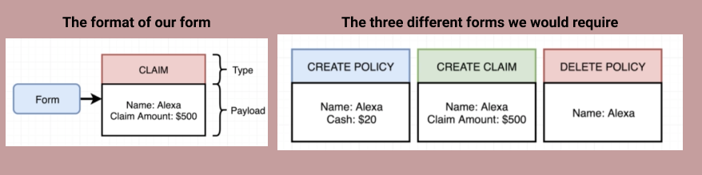
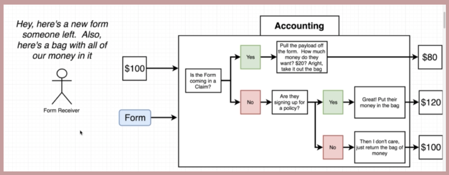
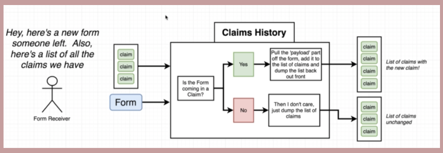
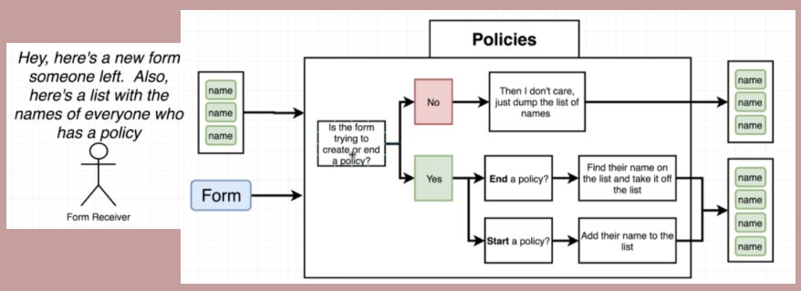
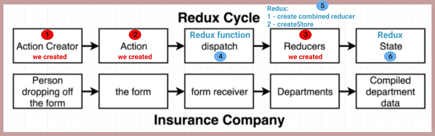

# redux-learn

## Goals
- [ ] Understand what Redux is.
- [ ] How it relates to React.

### Redux is:- 
1. A state management library.
2. It makes creating complex applications (ie with state) easier.
3. Not required in order to create a React app.
4. Not explicitly designed to work with React, can  be used with other libraries and languages.

### We have React why do we need Redux?
The React library is all about rendering content on the screen and handling user interaction.
Its primary role is not around maintaining, updating, deleting or otherwise handling data, thus we can make redux in charge of this.  


## The Redux Cycle

Basically what happens internally inside of Redux.


                -----------------------------------------------------------------------------

## Analogy to explain Redux:-

We own an insurance company, in which our customers have:-
- policy (customer purchases/holds a `policy`)
- claim ( a customer can make a `claim`)


Our insurance company has three departments, 
- Claims History
  - Stores/updates list of claimants
- Policies
  -  Stores/updates the list of policy holders (by name)
- Accounting
  - Controls the bad of cash, ie money in (new policies), money  out (claims made)

The Departments operate in isolation, in that they do not communicate with each other, each department receives its information from the receiver (front office).

The receiver (front office), is in fact a single person called lazy Brian, for whom inertia is his favourite pastime. When Brian receives a form he copies it and sends it out to all three departments.


                -----------------------------------------------------------------------------

## Information held in each department


After watching Wolf of Wall Street, the management decide the only way to make big bucks is to issue an IPO, in order to progress matters they want hourly reports from departments.

Currently on an hourly basis the management team have to leave their important work, of playing team darts... and go to each department to get the latest update/cash total.


                -----------------------------------------------------------------------------


## Switch information to a central location


Donnie one of the management team, decide that the doesn't want to leave the team meetings anymore and dictates that all the reports and bag of cash will be held in one location outside the directors meeting room. Lazy Brian, upon realising that he will have to do some work, decide to retire as he says to 'put his feet up'. The new receiver 'dynamic' Dave, has the following duties:-

1. - when a form is received from a customer, three copies are made (one for each department)
2. - that departments list/total bag of money is taken from the central location
3. - the above two are handed to the relevant department

                -----------------------------------------------------------------------------

## Form: Structure & Types



Every form received will consist of two distinct sections, `Type` and `Payload`.

There will be three types of form required

1. - `CREATE POLICY`
   - The payload information will be required by the Policies dept & Accounting dept.
     - Policy dept --> to create a policy holder (ie record name on policies list)
     - Accounting dept --> for the cash amount, to add to the bag of cash. 

2. - `CREATE CLAIM`
   - The payload information will be required by the Claims History dept & Accounting dept.
     - Claims History dept --> to record the name of the claimant.
     - Accounting dept --> to payout the claim amount from the bag of cash.

3. - `DELETE POLICY`
   - The payload information is required by the Policies dept.
     - Policy dept --> to remove the policy holders name from the policies list.


                -----------------------------------------------------------------------------

## So what would this look like in our JS code:

```js
const createPolicy = (name, amount) => { //Action creator (customer in our analogy)
  return { //Action (a form in our analogy)
    type: CREATE_POLICY,
    payload: {
      name: name,
      amount: amount
    }
  };
};

const createClaim = (name, claimAmount) => {
  return {
    type:CREATE_CLAIM,
    payload: {
      name: name,
      claimAmount: claimAmount
    }
  };
};

const deletePolicy = (name) => {
  return {
    type:DELETE_POLICY,
    payload: {
      name: name
    }
  };
};
```
So we have created the three forms `Actions` and also how each for will be intialised `Action creator`.

                -----------------------------------------------------------------------------


## What the three different departments will do:-




How would this look in our code:-  

```js
// Reducer (Department - Accounting)
const accounting = (bagOfMoney = 100, action) => {
  if(action.type === 'CREATE_CLAIM') {
    return bagOfMoney - action.payload.claimAmount;
  } else if(action.type === 'CREATE_POLICY') {
    return bagOfMoney + action.payload.amount;
  }
  return bagOfMoney;
};
```

                -----------------------------------------------------------------------------




How would this look in our code:-  

```js

// Reducer (Department - Claims History)
const claimsHistory = (oldListOfClaims = [], action) => {
  if(action.type === 'CREATE_CLAIM') {
    return [...oldListOfClaims, action.payload];
  }
  return oldListOfClaims;
};
```



How would this look in our code:-  

```js

// Reducer (Department - Policies)
const policies = (listOfPolicies = [], action) => {
  if(action.type === 'CREATE_POLICY') {
    return [...listOfPolicies, action.payload.name];
  } else if (action.type === 'DELETE_POLICY') {
    return listOfPolicies.filter(name => name !== action.payload.name);
  }
  return listOfPolicies;
};
```

                -----------------------------------------------------------------------------


### What we have:-




## We create points 1, 2 & 3
Point 2 - Every action will have a
  - `type` which is convention to have as an uppercase string.
  - `payload` which is an object containing information required by the `reducer` functions.

Point 1 - This is the function (`Action creator`) we create to give us the object (`action`) we want.

Point 3 - This is the function (`Reducer`) we create to handle the Action.

## Redux gives us 4,5 & 6

Point 5 - whilst we create the `reducers` we must tell Redux about them, so that Redux can create a single overall reducer ie `combined reducer` and also create a redux instance ie `createStore`.

Point 4 - `dispatch` is just a method that we call passing into it the action creator.

Point 6 - This is our `state` ie our central location of data.

                -----------------------------------------------------------------------------


## In Summary


1. Action Creator - Person dropping off the form ***- (WE CREATE THIS)***
    - A function that returns a plain JS object, ie it creates the action below thats all.
2. Action - The form ***- (WE CREATE THIS)***
    - The plain JS object above is referred to as an action.
    - It has `type` & `payload` properties.
      - `type property` describes some change that want to make inside of our data.
      - `payload property` describes what we want to change to.
    - so it basically describes what data we want to change & how we want it to change. 
3. Dispatch - Form receiver **- PART OF REDUX**
   - The dispatch function, takes in the action object and makes copies of it and passes those copies off to different places.
4. Reducers - Departments ***- (WE CREATE THESE)***
   - A reducer is a function that is responsible for taking in an action and some existing amount of data.
     - It process that action by type (if applicable)
     - Makes changes to the applicable data
     - Returns that 'updated' data 
5. State - Compiled department data **- PART OF REDUX**
   - It's an object.
   - It is the central repository, that holds all the data produced/updated by our reducers.


