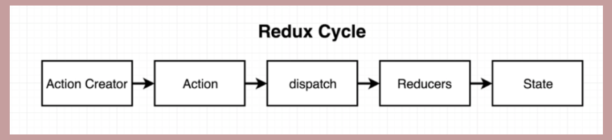
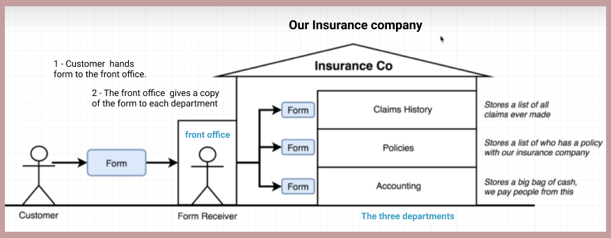
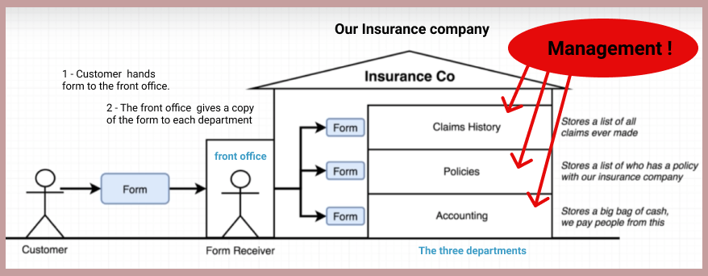
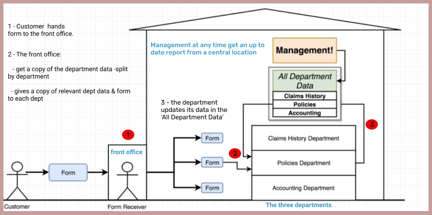
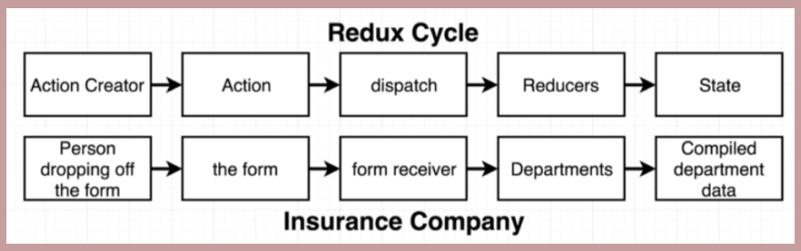

# redux-learn

## Goals
-[ ] Understand what Redux is

### Redux is:- 
1. A state management library.
2. Its makes creating complex applications (ie with state) easier.
3. Not required in order to create a React app.
4. Not explicitly designed to work with React, its used with other libraries and languages.

### We have React why do we need Redux?
The React library is all about rendering content on the screen and handling user interaction.
Its primary role is not around maintaining, updating, deleting or otherwise handling data, thus we make redux in charge of this.  

## The Redux Cycle

Basically what happens internally inside of Redux.

Analogy to explain Redux:-

We own an insurance company, in which our customers have:-
- policy (customer purchases/holds a `policy`)
- claim ( a customer can make a `claim`)

blah blah blah

blah blah

blah blah

Blah blah

1. Action Creator - Person dropping off the form
    - A function that returns a plain JS object, ie it creates the action below thats all.
2. Action - The form
    - The plain JS object above is referred to as an action.
    - It has `type` & `payload` properties.
      - `type property` describes some change that want to make inside of our data.
      - `payload property` describes what we want to change to.
    - so it basically describes what data we want to change & how we want it to change. 
3. Dispatch - Form receiver
   - cccc
4. Reducers - Departments
   - cccc
5. State - Compiled department data
   - ccc

flflflflf
